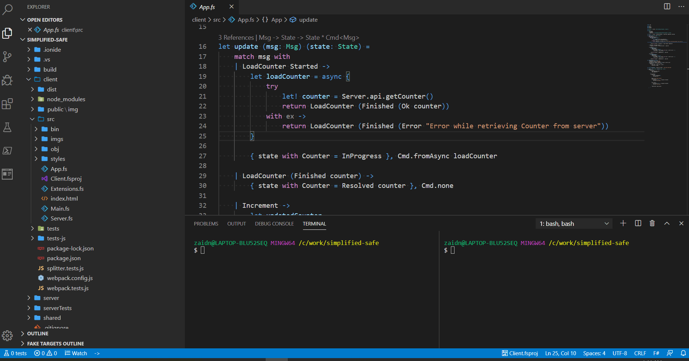

# Simplified SAFE Stack

A simplified alternative template to the full-fledged official [SAFE Template](https://github.com/SAFE-Stack/SAFE-template). Lowers the entry barrier by choosing the simplest possible opinionated defaults:
 - Nuget for package management
 - [FAKE](https://fake.build/) build script as a console project (see ./build)
 - [Saturn](https://github.com/SaturnFramework/Saturn) as server web framework
 - [Fable.Remoting](https://github.com/Zaid-Ajaj/Fable.Remoting) for client-server communications
 - [Feliz](https://github.com/Zaid-Ajaj/Feliz) as the React DSL on the front-end
 - [Expecto](https://github.com/haf/expecto) for server unit-tests project
 - [Fable.Mocha](https://github.com/Zaid-Ajaj/Fable.Mocha) for client unit-tests project (runs in Node.js when on CI servers or live during development)

### Using This Template

Clone this repository or use it as template via Github UI to get started. Currently there are no plans to publish a separate dotnet template for it.

### Running The Application

To work with and develop the application, you need to both the server and the client project running at the same time. The server application is in the `server` directory and the client is in `client` directory. To run them both, simply open two shell tabs, each for either applications then:
```bash
  Shell tab c:\project\simplified-safe   Shell tab c:\project\simplified-safe
 -------------------------------------- --------------------------------------
  > cd server                            > cd client
  > dotnet restore                       > npm install
  > dotnet run                           > npm start
```
As shown here below



The server web application starts listening for requests at `http://localhost:5000` where as the client application will be hosted at `http://localhost:8080` during developments. All web requests made from the front-end are automatically proxies to the backend at `http://localhost:5000`. In production, there will no proxy because the front-end application will be served from the backend itself.

> That is unless you are hosting the backend serverless and would like to host the front-end project separately.

### Available Build Targets

You can easily run the build targets as follows:
 - `./build.sh {Target}` on Linux/Mac
 - `build {Target}` on Windows
 - Hitting F# where `Build.fsproj` is the startup project

There are a bunch of built-in targets that you can run:
 - `Server` builds the server in Release mode
 - `Client` builds the client in production mode
 - `Clean` cleans up cached assets from all the projects
 - `ServerTests` runs the server unit-tests project
 - `ClientTests` runs the client unit-tests project by compiling the project first and running via Mocha in node.js
 - `LiveClientTests` runs a standalone web application at `http://localhost:8085` that shows test results from the unit tests and recompiles whenever the tests change.